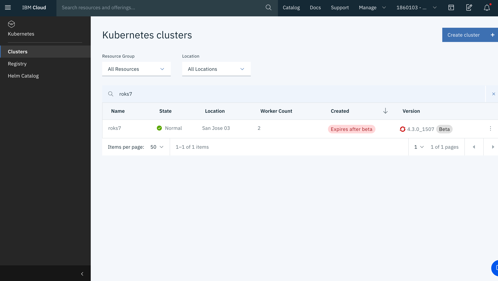

# Create account and get cluster

In this section, you will login to your own IBM Cloud account, and then get access to a IBM Cloud Lab account which contains pre-provisioned clusters. Each lab attendee will be granted access to one cluster.

## Set up your IBM Cloud ID

* Log into IBM Cloud with an existing account: [https://cloud.ibm.com](https://cloud.ibm.com)

OR

* Create your own: [http://cloud.ibm.com/registration](http://cloud.ibm.com/registration)

## Access the Cluster using the Console

1. Instructors will provide a URL to a web app. Enter your IBMid \(the email you used to sign up\) and the lab key \(also provided by the instructor\).

    

2. Follow the instructions on the next page. You will be added to the IBM Workshop account and granted access to a cluster. Note the name of your cluster. In the example below, it's `roks07`.

    

3. Back in IBM Cloud, refresh the [IBM Cloud Dashboard](https://cloud.ibm.com). If required, switch to the **1860103 - IBM** account by clicking on the account selection drop down in the top nav bar.

    

4. Click on **Clusters** in the **Resource Summary** tile.

    

5. Under **Clusters**, click on the cluster that has been assigned to you.

    

6. You can also see your cluster in the list of OpenShift clusters [IBM Cloud Clusters Dashboard](https://cloud.ibm.com/kubernetes/clusters?platformType=openshift)

    

7. Have a look at the cluster overview!

    

8. Click on **OpenShift web console** on the top right to launch the web console.

    

# Access the cluster using the command line (CLI)

To easily connect to the cluster, you need the OpenShift CLI `oc` that exposes commands for managing your applications, as well as lower level tools to interact with each component of your system. 

This topic guides you through getting started with the CLI, including installation and logging in.

## Use IBM Cloud Shell

To avoid installing the command line, the recommended approach is to use the IBM Cloud Shell is a cloud-based shell workspace that you can access through your browser.

It's preconfigured with the full IBM Cloud CLI and tons of plug-ins and tools that you can use to manage apps, resources, and infrastructure.

1. In the Console menu bar, click the IBM Cloud Shell icon to start a session

    

1. A session starts and automatically logs you in through the IBM Cloud CLI.

    


## Connect to the OpenShift cluster

1. In the OpenShift web console, click on the email/ID in the upper right. Choose the _Copy Login Command_ option.

    


1. In a Shell termimal, paste the login command you copied from the web console.

    ```bash
    oc login https://c100-e.us-south.containers.cloud.ibm.com:30360 --token=NYVkVysxxxxxxxxxxxxxxxxxxxxRQa8tM
    ```

    You should see a success message similar to the one below:

    ```bash
    oc login https://c100-e.us-south.containers.cloud.ibm.com:30360 --token=NYVkVysxxxxxxxxxxxxxxxxxxxxRQa8tM

    Logged into "https://c100-e.us-south.containers.cloud.ibm.com:30360" as "IAM#firstname.lasname@ibm.com" using the token provided.

    You have access to the following projects and can switch between them with 'oc project <projectname>'
    ```
Your CLI is now connected to your Red Hat OpenShift cluster running in IBM Cloud.


## Validate cluster access using `oc` commands

1. View nodes in the cluster.

    ```bash
    oc get node
    ```

2. View services, deployments, and pods.

    ```bash
    oc get svc,deploy,po --all-namespaces
    ```

3. View projects

    ```bash
    oc get projects
    ```

You've completed the getting started! Let's recap -- in this section, you:

* Got an OpenShift cluster and accessed its Web Console.
* Connected your local CLI to a running OpenShift cluster on IBM Cloud