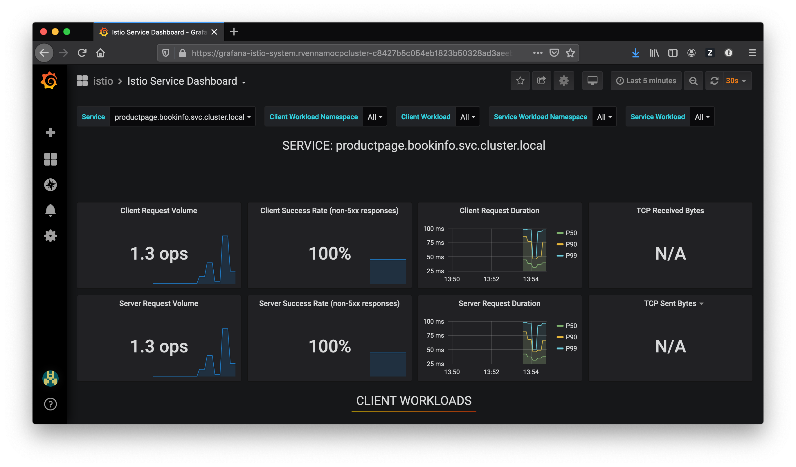
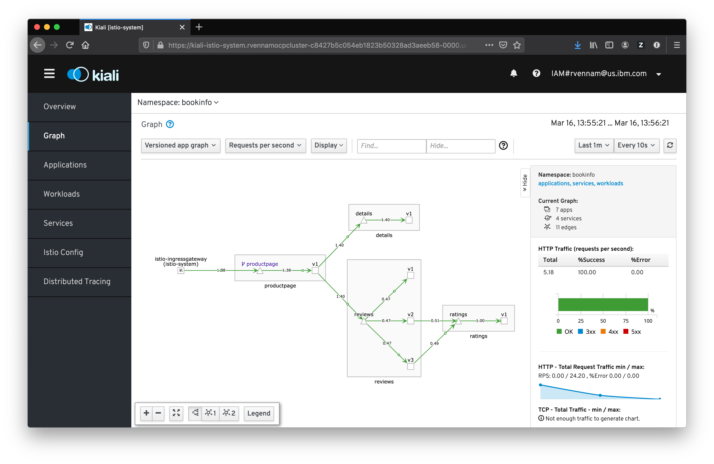

# Exercise 5 - Observe service telemetry: metrics and tracing

### Challenges with microservices

We all know that microservice architecture is the perfect fit for cloud native applications and it increases the delivery velocities greatly. Envision you have many microservices that are delivered by multiple teams, how do you observe the the overall platform and each of the service to find out exactly what is going on with each of the services?  When something goes wrong, how do you know which service or which communication among the few services are causing the problem?

### Istio telemetry

Istio's tracing and metrics features are designed to provide broad and granular insight into the health of all services. Istio's role as a service mesh makes it the ideal data source for observability information, particularly in a microservices environment. As requests pass through multiple services, identifying performance bottlenecks becomes increasingly difficult using traditional debugging techniques. Distributed tracing provides a holistic view of requests transiting through multiple services, allowing for immediate identification of latency issues. With Istio, distributed tracing comes by default. This will expose latency, retry, and failure information for each hop in a request.

You can read more about how [Istio mixer enables telemetry reporting](https://istio.io/docs/concepts/policy-and-control/mixer.html).


Generate a small load to the app by sending traffic to the Ingress host location you set in the last exercise.

```shell
for i in {1..20}; do sleep 0.5; curl $INGRESS_HOST/productpage; done
```

## View bookinfo telemetry data

#### Grafana

1. Navigate to your cluster in the [IBM Cloud Dashboard](https://cloud.ibm.com/kubernetes/clusters)
2. Click on your cluster and launch **OpenShift web console**
4. Under **Networking** -> **Routes**, select the URL next to **grafana**
3. Click on Home -> Istio -> Istio Service Dashboard.
4. Select `bookinfo` in the Service drop down.



This Grafana dashboard provides metrics for each workload. Explore the other dashboards provided as well.


#### Kiali

Kiali is an open-source project that installs as an add-on on top of Istio to visualize your service mesh. It provides deeper insight into how your microservices interact with one another, and provides features such as circuit breakers and request rates for your services.

1. Navigate to your cluster in the [IBM Cloud Dashboard](https://cloud.ibm.com/kubernetes/clusters)
2. Click on your cluster and launch **OpenShift web console**
4. Under **Networking** -> **Routes**, select the URL next to **kiali**
5. Click the "Graph" tab on the left side and select the `bookinfo` and `istio-system` namespace to see the a visual service graph of the various services in your Istio mesh. You can see request rates as well by clicking the "Edge Labels" tab and choosing "Traffic rate per second".
    > Info: You'll need to access your BookInfo application and type an entry for the graph to be generated and connected properly.
6. In a different tab, visit the BookInfo application and refresh the page multiple times to generate some load, or run the load script in the previous section.

Kiali has a number of views to help you visualize your services. Click through the various tabs to explore the service graph, and the various views for workloads, applications and services.

 


#### [Continue to the next Exercise](../exercise-6/README.md)
